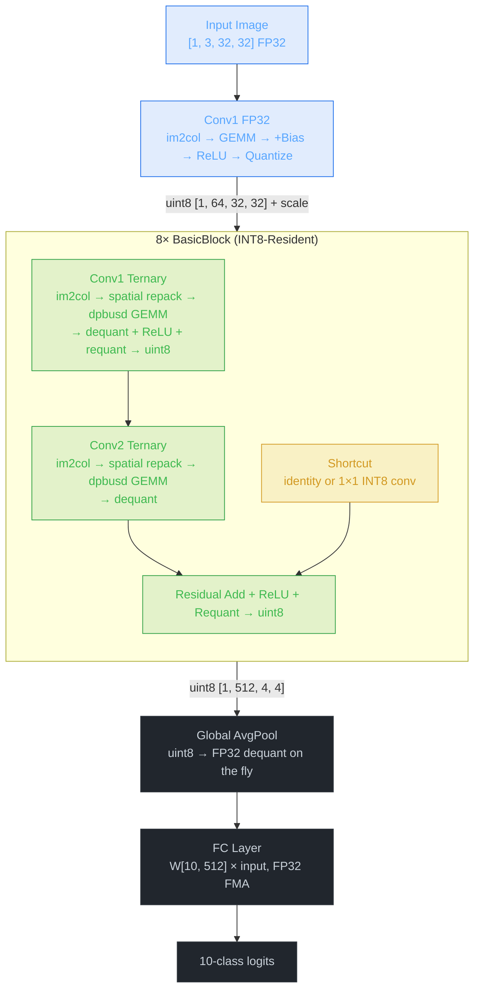

# Inference Pipeline

Detailed data flow through the INT8-resident ternary ResNet-18 engine.

> **Visual version:** [inference_pipeline.html](inference_pipeline.html) (open locally or via GitHub Pages)

## High-Level Overview



## Stage-by-Stage Breakdown

### Stage 1: Conv1 (FP32 Input)

The only layer that operates on FP32 input. The original image arrives as 3x32x32 float.

```
Input: FP32 tensor [1, 3, 32, 32]
    |
    +--> im2col: gather 3x3 patches into column matrix
    |      col shape: [27, 1024]  (3*3*3 rows, 32*32 cols)
    |
    +--> FP32 GEMM: W[64, 27] x col[27, 1024]
    |      parallelized over output channels (OpenMP)
    |
    +--> Fused: + bias --> ReLU --> quantize to uint8
    |      scale = calibrated max / 255
    |
Output: uint8 tensor [1, 64, 32, 32], scale factor
```

After this point, **no FP32 activations exist** until the final avgpool.

### Stage 2: BasicBlock (x8, INT8-Resident)

Each block follows the same pattern. All activations are uint8.

```
x (uint8, from previous block)
    |
    +-----+---------------------------+
    |     |                           |
    |   [Conv1 ternary]           [Shortcut]
    |     |                           |
    |     |  im2col(uint8)            |  (identity or 1x1 conv)
    |     |  spatial repack           |
    |     |  dpbusd GEMM              |
    |     |  epilogue: dequant+ReLU   |
    |     |  --> uint8                |
    |     |                           |
    |   [Conv2 ternary]               |
    |     |                           |
    |     |  im2col(uint8)            |
    |     |  spatial repack           |
    |     |  dpbusd GEMM              |
    |     |  epilogue: dequant        |
    |     |                           |
    |     +----------+----------------+
    |                |
    |           [Residual Add]
    |                |
    |           [ReLU + Requant]
    |                |
    v           --> uint8
    x_next
```

### Stage 3: AvgPool + FC

```
Final uint8 tensor [1, 512, 4, 4]
    |
    +--> Global average pool (uint8 --> FP32 dequant on the fly)
    |      output: [1, 512, 1, 1] FP32
    |
    +--> FC layer: W[10, 512] x input[512]
    |      FP32 dot product with FMA
    |
Output: 10-class logits (FP32)
```

## The dpbusd GEMM Kernel

The core compute kernel. Processes 32 MACs per instruction using `_mm256_dpbusd_epi32`.

### Memory Layout: Spatial Packing

The key insight that delivered an 8x speedup (79ms to 9.7ms). Instead of the naive layout where each SIMD lane holds a partial sum that needs horizontal reduction, we pack **8 spatial positions** into one YMM register.

```
Naive (slow):                      Spatial-packed (fast):
                                   
ymm = [s0 s1 s2 s3 s4 s5 s6 s7]  ymm = [p0 p1 p2 p3 p4 p5 p6 p7]
       \_____partial sums______/          \__8 output positions___/
       need hadd to reduce                 each lane independent!

After dpbusd:                      After dpbusd:
  Must reduce 8 --> 1 (slow)         Each lane has its own output (done)
```

### Tiling: 14 Output Channels

Inspired by ONNX Runtime's MLAS kernel (discovered via disassembly). We keep 14 OC accumulators live in YMM registers simultaneously:

```
Registers:
  r0..r13  = 14 OC accumulators (each holds 8 spatial positions)
  a        = activation vector (8 spatial x 4 reduction, broadcast)
  w        = weight (4 packed int8, broadcast to all lanes)

Inner loop (per 4-element reduction group):
  a    = load 32 bytes from col_packed
  w    = pack4(weight[oc0..oc0+3])    // 4 weights --> 1 int32
  r0   = dpbusd(r0, a, broadcast(w))  // 32 MACs
  w    = pack4(weight[oc1..oc1+3])
  r1   = dpbusd(r1, a, broadcast(w))  // 32 MACs
  ...
  r13  = dpbusd(r13, a, broadcast(w)) // 32 MACs

  Total: 14 x 32 = 448 MACs per loop iteration
```

### Epilogue Modes

After the GEMM accumulates int32 results, the epilogue converts back:

| Mode | Operation | Used By |
|------|-----------|---------|
| 0 | dequant to FP32 only | Conv2 before residual add (shortcut blocks) |
| 1 | dequant + ReLU + requant to uint8 | Conv1 in each block |
| 2 | dequant + residual add + ReLU + requant to uint8 | Conv2 with identity shortcut |

```
int32 accumulators
    |
    +--> cvt to FP32
    +--> multiply by (alpha * act_scale / out_scale)  // dequant
    +--> add bias
    +--> [optional] add residual (from uint8 or FP32)
    +--> [optional] ReLU (max with 0)
    +--> [optional] requant: multiply by 1/out_scale, clamp [0,255], cvt to uint8
```

## im2col: Specialized 3x3 Stride-1

12 of 16 ternary convolutions are 3x3 with stride 1 and padding 1. For this case, a specialized path replaces per-element gather with per-row memcpy:

```
Generic im2col:                    Specialized 3x3 s1p1:
  for each kh, kw:                   for each of 9 (kh,kw) positions:
    for each output position:          for each input channel:
      bounds check                       memcpy entire row (or zero for padding)
      load one element                   --> sequential access, prefetcher-friendly

  Per-element scatter                Bulk memcpy per row
  30% of runtime                     7.4% of runtime
```

After im2col, the uint8 column buffer is repacked into spatial-packed layout for the dpbusd kernel:

```
col_u8 [col_rows, col_cols]  -->  col_packed [col_cols/8, col_rows/4, 32 bytes]
                                  groups of 8 spatial x 4 reduction, contiguous
```

## Weight Representation

### Storage: 2-bit I2_S Format

4 weights per byte, MSB first:

```
Encoding: +1 --> 0b01, 0 --> 0b00, -1 --> 0b11

Byte: [w0_hi w0_lo | w1_hi w1_lo | w2_hi w2_lo | w3_hi w3_lo]

Model size: 44.69 MB (FP32) --> 3.56 MB (I2_S + per-channel scales)
             92.2% reduction
```

### Runtime: Unpacked to INT8

At engine initialization, 2-bit weights are unpacked to int8 `{-1, 0, +1}` and pre-packed into 4-element groups for dpbusd broadcast:

```
pack4_i8(w0, w1, w2, w3) = w0 | (w1 << 8) | (w2 << 16) | (w3 << 24)
```

This trades 4x storage for zero-cost weight access during inference. The weights fit comfortably in L2 cache.

## Memory Budget

All buffers are preallocated at engine init. Zero `malloc` on the inference hot path.

| Buffer | Size | Purpose |
|--------|------|---------|
| `col_u8` | 4608 KB | im2col output (uint8) |
| `col_packed` | 4608 KB | Spatial-repacked layout for dpbusd |
| Activation ping-pong (x3) | ~192 KB | uint8 activations between blocks |
| FP32 scratch (x2) | ~512 KB | Conv1 output, shortcut intermediates |
| **Total workspace** | **~9.5 MB** | Reused every inference |

## Threading Model

OpenMP parallelism at three levels:

1. **Conv1 FP32**: parallel over output channels (`omp for` over 64 OC)
2. **im2col + repack**: `omp single` for im2col (sequential memcpy), then `omp for` for spatial repacking
3. **dpbusd GEMM**: `omp for` over output channel groups (14-OC tiles)

All threads stay alive inside a single `omp parallel` region per inference call. The 8 BasicBlocks execute sequentially within the parallel region, with `omp single` and `omp for` directives controlling which work is serial vs parallel.

```
Thread 0: [im2col] [--- GEMM oc0..oc13 ---] [im2col] [--- GEMM oc0..oc13 ---] ...
Thread 1:          [--- GEMM oc14..oc27 --]           [--- GEMM oc14..oc27 --] ...
Thread 2:          [--- GEMM oc28..oc41 --]           [--- GEMM oc28..oc41 --] ...
...
  barrier            barrier                  barrier            barrier
```

## Per-Layer Timing Breakdown (1T, 200 runs, measured)

| Phase | Time | % of Total |
|-------|------|------------|
| Conv1 FP32 + ReLU + quant | 0.154 ms | 4.1% |
| Ternary im2col + repack | 1.076 ms | 28.3% |
| Ternary GEMM + epilogue | 2.565 ms | 67.6% |
| Pool + FC | 0.002 ms | 0.1% |
| **Total** | **3.797 ms** | |

**6-Thread median: 0.99ms** (50 warmup, 200 measurement runs)
